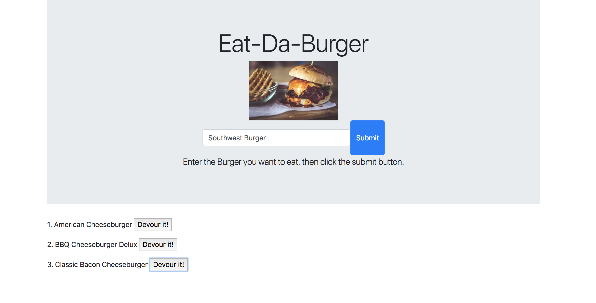

# eat-da-burger

* Eat-Da-Burger! is a restaurant app that lets users input the names of burgers they'd like to eat.
* Whenever a user submits a burger's name, the app will display the burger on the left side of the page -- waiting to be devoured.
* Each burger in the waiting area also has a `Devour it!` button. When the user clicks it, the burger will move to the right side of the page.

## Getting Started

These instructions will get you a copy of the project up and running on your local machine for development and testing purposes. See deployment for notes on how to deploy the project on a live system.

To run the application locally, first clone this repository with the following command.

git clone https://github.com/tysheba/eat-da-burger.git

Next, install the application dependencies.

npm install express body-parser express-handlebars

Finally, run the node server locally.

node server.js

Now, open the local application on port 8080 at the URL: http://localhost:3000/.

click below for a Demo
https://glacial-bastion-35061.herokuapp.com/

